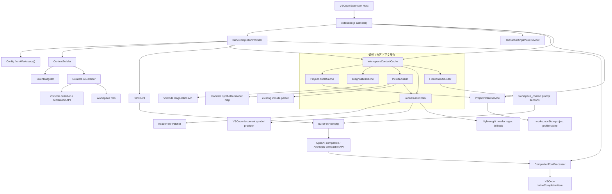

# TabTab

一个简单、轻量的 VSCode FIM 代码补全插件。

相比 GitHub Copilot，**TabTab 去除了无用的聊天和Agent功能**，仅保留核心的 **Tab 代码补全** 能力。

## 使用注意事项

建议使用较轻量的代码模型，以获得更低延迟和更好的补全体验，例如：

- GPT-5 mini
- Claude Haiku 4.5
- DeepSeek v4 Flash

个人推荐使用 **DeepSeek v4 Flash**。  
我也是基于该模型测试的。

## 代码功能拓扑图

关键链路：

- `extension.js` 激活扩展，注册 inline completion provider、设置页、项目画像服务和统一工作区上下文缓存。
- `InlineCompletionProvider` 是 Tab 补全主入口，组合普通 FIM 上下文、缓存上下文、远程请求和后处理。
- `WorkspaceContextCache` 是低频上下文的统一入口，FIM 请求路径只读取缓存快照，不全量扫描工程。
- `IncludeAssist` 基于 VSCode diagnostics 推断缺失的标准库头文件和项目本地头文件，只生成 prompt hint，不直接修改文件。
- `LocalHeaderIndex` 在后台维护本地头文件符号索引，用于把 undefined project symbol 映射到 quote include。
